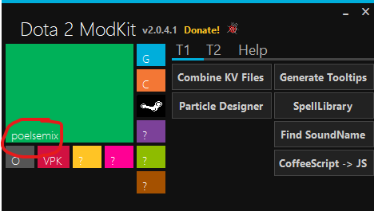

# Installing Poelsemix

Updated 16-02-2020

Q: Why should I read this shit?

A: Because the repository is set up in a less than ideal way.

## Requirements

#### 1. **[Steam](http://steampowered.com)**
#### 2. Dota 2 Workshop Tools
- Download Dota 2
- Right click and select properties
- Go to DLC and select Dota 2 Workshop Tools

## Cloning
### Please do the following in a CLI. If you know how to do it in a GUI, go ahead and do so.
 1. Find the Dota 2 root folder 'dota 2 beta'
 2. Move everything inside 'dota 2 beta' (not the folder itself) somewhere else
 3. Navigate to 'dota 2 beta' in your preferred shell and do:
 
```shell
git clone https://github.com/Kroqh/Poelsemix.git . 
```
 4. Move the content from step 2 back into 'dota 2 beta'

You should now be able to run Poelsemix inside Dota 2 Workshop Tools.

## Dota 2 Modkit

Please install **[Dota 2 Modkit](https://drive.google.com/open?id=166mkIG_tp6-sTXDag0i2YowK3zKIJn_0)**, and select Poelsemix as seen below:



